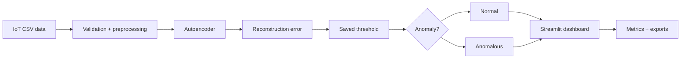

# IoT Autoencoder Anomaly Detection


A final-year software engineering project that applies an **autoencoder neural network** to anomaly detection in IoT network traffic. The repository combines data preparation, model training, threshold selection, scoring, evaluation, testing and an interactive Streamlit application into one reproducible workflow.

> This is an academic engineering artefact rather than a production intrusion-detection system. The focus is on demonstrating a complete, explainable and testable machine-learning application.

## Portfolio highlights

- Built an end-to-end **machine learning pipeline** for unsupervised anomaly detection.
- Trained an autoencoder on benign IoT traffic so unusual records can be identified through reconstruction error.
- Created an interactive **Streamlit** application for data selection, validation, model preparation, scoring and export.
- Added evaluation views for **precision, recall, F1-score, PR-AUC, TP, FP, TN and FN** where labels are available.
- Added reusable modules for validation, repair, scoring, exports and application behaviour.
- Added **Pytest** coverage and automated GitHub Actions testing.
- Added **Docker** and Docker Compose for repeatable execution.
- Documented architecture, design decisions, evaluation, privacy/scope and accessibility.

## Skills demonstrated

| Area | Evidence in the project |
| --- | --- |
| Python | Modular application code, scripts, data processing and testing |
| Machine learning | Autoencoder training, preprocessing, reconstruction error and thresholding |
| TensorFlow / Keras | Model training, saving and inference |
| Data engineering | CSV preparation, feature validation, missing-value/duplicate handling |
| Evaluation | Precision, recall, F1, PR-AUC and confusion-style counts |
| Streamlit | Guided UI, model workflow, visual analysis and downloads |
| Testing | Pytest test suite executed in CI |
| DevOps | Docker, Docker Compose and GitHub Actions |
| Documentation | Architecture, design, evaluation and scope documentation |

## System workflow



### Training path

The model is trained on **benign-only traffic** so it learns a representation of normal connection behaviour. The training workflow stores the fitted preprocessing artefacts, trained model and threshold required for later scoring.

### Inference path

Incoming tabular records are transformed using the saved preprocessor, passed through the autoencoder and assigned reconstruction-error values. Records above the selected threshold are flagged as anomalous.

## Application workflow

The Streamlit application provides a guided seven-step journey:

1. **Select Data** — choose the project dataset or upload a compatible CSV.
2. **Repair Data** — validate and optionally clean common data-quality problems.
3. **Select Model** — choose a saved `.keras` or `.h5` model.
4. **Prepare Model** — load preprocessing artefacts, feature information and threshold.
5. **Test Model** — run scoring and inspect the result summary.
6. **Export** — download scored data, metrics and supporting reports.
7. **Use Model** — upload compatible data and check it for unusual activity.

Additional views provide data inspection, model information, threshold context, explainability, simulation and export management.

## Technology stack

- **Python 3.10**
- **TensorFlow / Keras 2.12**
- **Streamlit 1.36**
- **pandas / NumPy**
- **scikit-learn**
- **Plotly / Matplotlib**
- **Pytest**
- **Docker / Docker Compose**
- **GitHub Actions**

## Repository structure

```text
.
├── app.py                      # Streamlit entry point
├── train.py                    # Training pipeline
├── evaluate.py                 # Evaluation script
├── requirements.txt            # Pinned Python dependencies
├── Dockerfile
├── docker-compose.yml
├── data/processed/             # Processed IoT dataset
├── models/                     # Saved model + preprocessing artefacts
├── src/                        # Core scoring/validation/export modules
├── views/                      # Streamlit workflow and analysis pages
├── tests/                      # Pytest suite
├── docs/                       # Architecture/design/evaluation documentation
├── diagrams/                   # Mermaid architecture diagrams
└── .github/workflows/ci.yml    # Automated test workflow
```

## Quick start

### 1. Create and activate a virtual environment

Windows:

```cmd
python -m venv .venv
.\.venv\Scripts\activate
```

macOS/Linux:

```bash
python3 -m venv .venv
source .venv/bin/activate
```

### 2. Install dependencies

```bash
python -m pip install --upgrade pip
pip install -r requirements.txt
```

### 3. Run the Streamlit app

```bash
python -m streamlit run app.py
```

Streamlit normally opens the application on `http://localhost:8501`.

## Docker

```bash
docker compose up --build
```

Then open `http://localhost:8501`.

## Testing and CI

Run the test suite locally:

```bash
python -m pytest tests/ -q
```

The GitHub Actions workflow uses **Python 3.10**, installs the pinned dependencies and runs the test suite automatically on pushes and pull requests.

## Evaluation

When suitable labels are available, the application reports:

- reconstruction error
- anomaly flag
- precision
- recall
- F1-score
- PR-AUC
- TP / FP / TN / FN style counts

When labels are unavailable, anomaly scoring still works, while supervised evaluation metrics are reported as unavailable.

All results are **dataset- and threshold-specific** and should not be interpreted as general security guarantees.

## Dataset scope

The implementation is centred on processed **CTU-IoT-23-style Zeek connection records**. Uploaded data is checked against the feature set expected by the saved preprocessor before scoring.

## Documentation

| Document | Purpose |
| --- | --- |
| [`docs/ARCHITECTURE.md`](docs/ARCHITECTURE.md) | Application structure and module layout |
| [`docs/DESIGN.md`](docs/DESIGN.md) | Design decisions and rationale |
| [`docs/EVALUATION.md`](docs/EVALUATION.md) | Evaluation process and testing protocol |
| [`docs/PRIVACY_AND_SCOPE.md`](docs/PRIVACY_AND_SCOPE.md) | Data handling and professional limitations |
| [`docs/ACCESSIBILITY.md`](docs/ACCESSIBILITY.md) | Accessibility considerations |
| [`docs/MODULE_MAP.md`](docs/MODULE_MAP.md) | File/module index |
| [`diagrams/ARCHITECTURE_DIAGRAMS.md`](diagrams/ARCHITECTURE_DIAGRAMS.md) | Mermaid system diagrams |
| [`CHANGELOG.md`](CHANGELOG.md) | Project evolution |

## Engineering scope

This repository demonstrates how a machine-learning model can be engineered into a usable software artefact rather than left as a standalone notebook. It includes model preparation, application state, validation, testing, visualisation, exports and deployment support.

It does **not** perform live packet capture and should not be treated as a deployed intrusion-detection system without further engineering, operational monitoring, security review and validation on additional datasets.

## Author

**Mohamed Ibrahim**  
BEng Software Engineering, University of Roehampton
