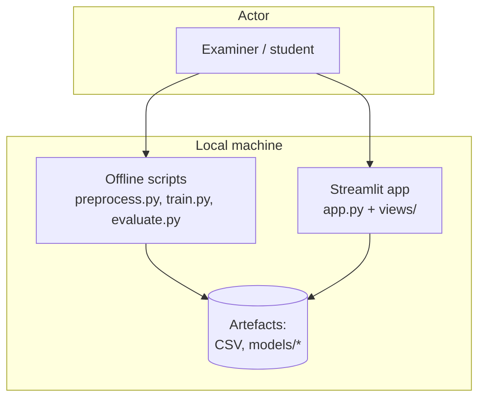
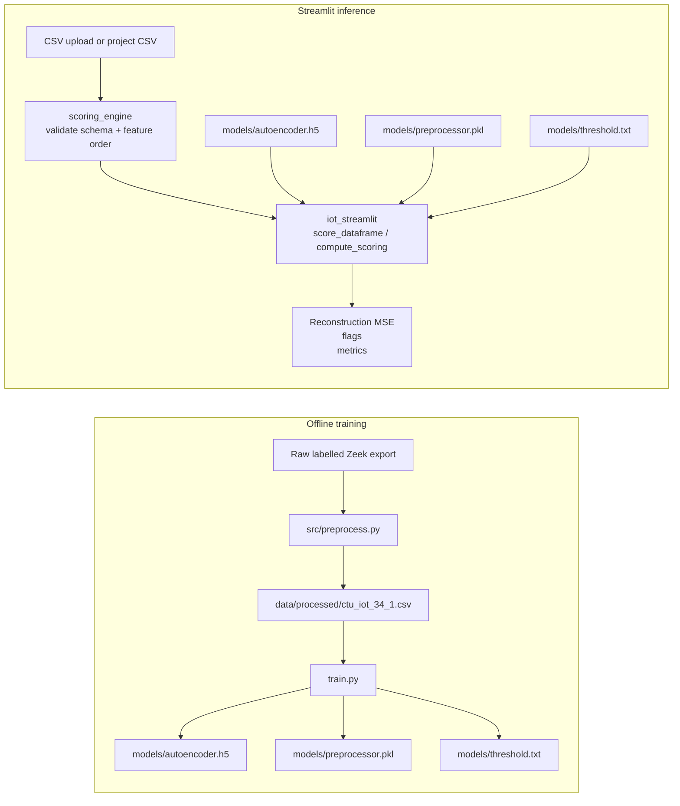
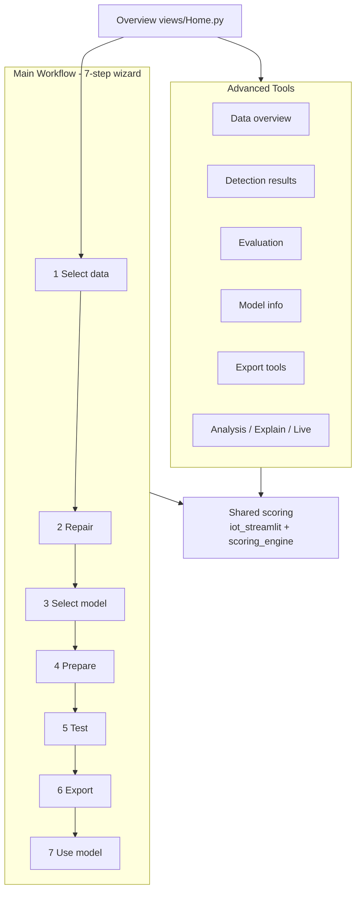
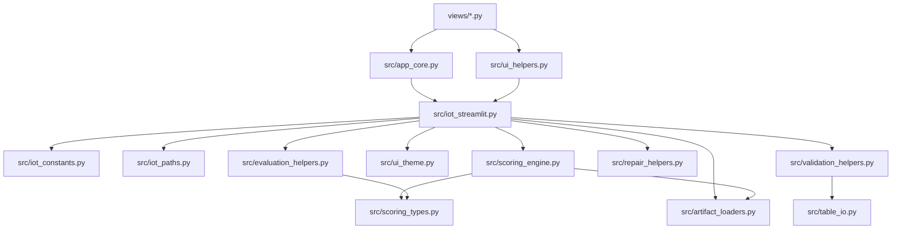

# Architecture Diagrams (Mermaid)

Render in GitHub, VS Code Mermaid preview, or export to PNG for the report.
This top-level folder is the canonical home for repository diagrams; source
code remains under `src/`, page code remains under `views/`, and supporting
written documentation remains under `docs/`.

## Final-Year Project Diagram Assets

These PNG diagrams were produced for the final-year project report and are
stored here as submitted visual artefacts.

| Diagram | Purpose |
|---|---|
| [IoT data pipeline design diagram.png](<IoT data pipeline design diagram.png>) | End-to-end IoT-23 anomaly-detection data pipeline from CSV ingestion through Streamlit output. |
| [System interaction sequence diagram.png](<System interaction sequence diagram.png>) | UML-style sequence diagram showing user, Streamlit UI, preprocessor, autoencoder, threshold module, and dashboard interactions. |
| [Edge cloud diagram.png](<Edge cloud diagram.png>) | Edge-to-cloud analytics architecture context for IoT anomaly detection. |
| [IoT anomaly detection use case diagram.png](<IoT anomaly detection use case diagram.png>) | Use case diagram for the network administrator and anomaly detection system capabilities. |
| [IoT anomaly detection data flow diagram.png](<IoT anomaly detection data flow diagram.png>) | Data-flow diagram showing IoT sources, preprocessing, autoencoder scoring, classification, dashboarding, and log export. |

## 1. System Context

## 2. Training Vs Inference

## 3. Information Architecture

## 4. Module Dependencies

